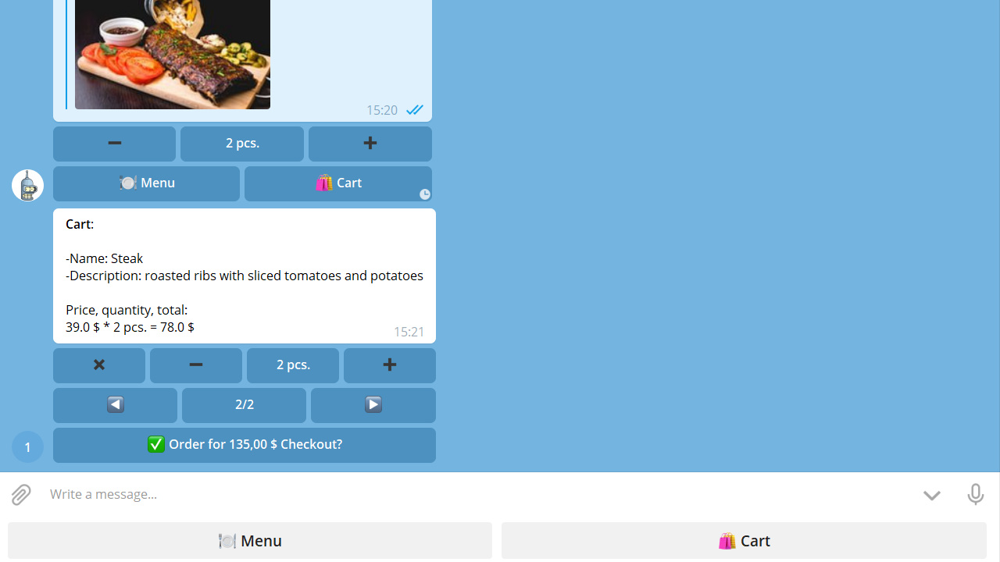
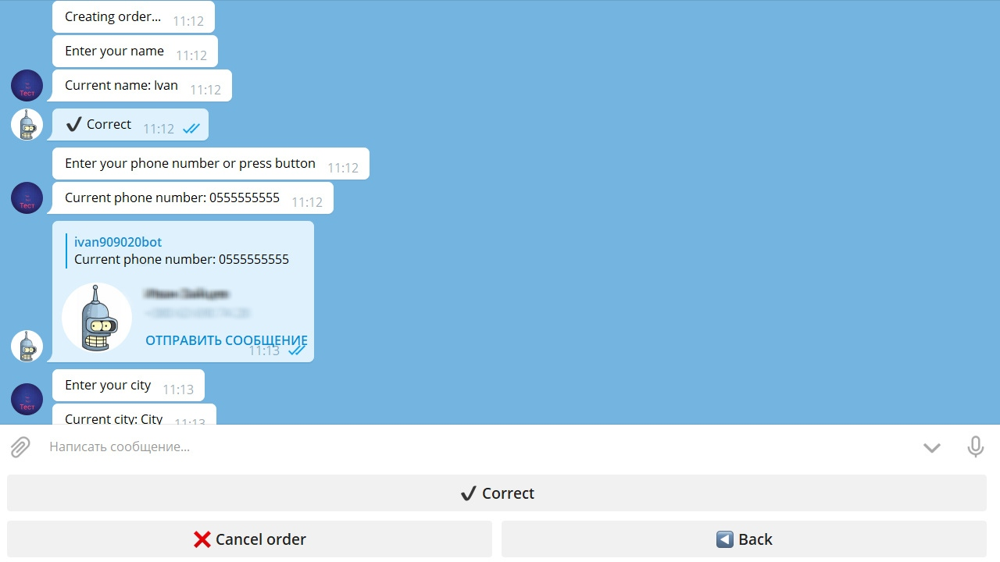
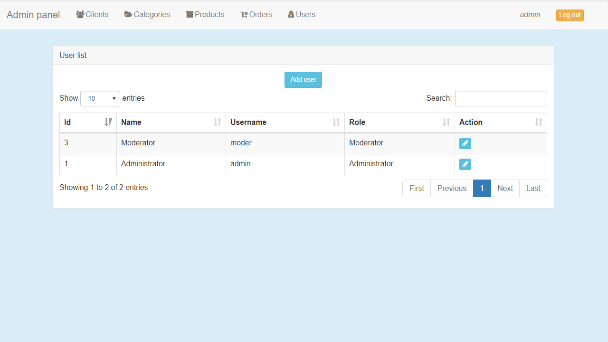

# shop-telegram-bot
Shop in telegram with admin panel

## Technology stack
Java 8, Maven, Spring Boot, Spring MVC, Spring Data, Spring Security, Hibernate, Postgresql, Freemarker, HTML, Telegram Bots

## Notes before deploy
- Telegram bot sends images as a link, if they are uploaded from the localhost, the bot will not be able to send them
- Telegram bot does not support raw ip address for sending images, you should use domain instead

## How to deploy with docker
```
mvn -f shop-telegram-bot/admin-panel/ package
mvn -f shop-telegram-bot/telegram-bot/ package

docker build -t shop-admin-panel shop-telegram-bot/admin-panel/
docker build -t shop-telegram-bot shop-telegram-bot/telegram-bot/

docker-compose -f shop-telegram-bot/docker-compose.yml up -d postgresql

docker exec -i shop-postgresql psql -U postgres -c "CREATE DATABASE shop_telegram_bot"
docker exec -i shop-postgresql psql -U postgres shop_telegram_bot < shop-telegram-bot/resources/db_schema.sql
docker exec -i shop-postgresql psql -U postgres shop_telegram_bot < shop-telegram-bot/resources/db_data.sql

docker-compose -f shop-telegram-bot/docker-compose.yml up -d admin-panel telegram-bot
```

## How to deploy manually
> 1. Install software

- Update and upgrade `sudo apt-get update && sudo apt-get upgrade`
- Install git `apt-get install git`
- Install maven `apt-get install maven`
- Install jdk 8 `apt-get install openjdk-8-jdk`
- Install postgres `apt-get install postgresql postgresql-contrib`
- Install nginx `apt-get install nginx`
- Clone repository `git clone https://github.com/ivan909020/shop-telegram-bot.git`
- Package admin panel `mvn -f shop-telegram-bot/admin-panel/ package`
- Package telegram bot `mvn -f shop-telegram-bot/telegram-bot/ package`

> 2. Set environment variables

Add database environment variables.

- DATABASE_URL (jdbc:postgresql://localhost:5432/shop_telegram_bot)
- DATABASE_USERNAME (postgres)
- DATABASE_PASSWORD (postgres)

Or you can manually change configuration in properties `telegram-bot/src/main/resources/hibernate.cfg.xml`
 and `admin-panel/src/main/resources/application.properties`

> 3. Create telegram bot

- Create a telegram bot [here](https://t.me/BotFather) and enable inline mode in settings
- Add telegram bot username and token to properties `telegram-bot/src/main/resources/application.properties`
- To receive notifications about new orders you need specify your chat id in properties

> 4. Set up database

Replace `your-directory` with directory where the cloned repository is located

- Login postgres user `sudo -i -u postgres`
- Connect postgres database `psql`
- Change password `\password`
- Create database `create database shop_telegram_bot;`
- Exit from postgres database `\q`
- Import database schema `psql -d shop_telegram_bot < /your-directory/shop-telegram-bot/resources/db_schema.sql`
- Import database data `psql -d shop_telegram_bot < /your-directory/shop-telegram-bot/resources/db_data.sql`
- Exit from postgres user `exit`

> 5. Set up admin panel

<details>
    <summary>Create systemd unit</summary>

Replace `your-directory` with directory where the cloned repository is located

`nano /etc/systemd/system/shop-admin-panel.service`

```
[Unit]
Description=shop-admin-panel
After=syslog.target

[Service]
WorkingDirectory=/your-directory/shop-telegram-bot/
ExecStart=/usr/bin/java -jar /your-directory/shop-telegram-bot/admin-panel/target/admin-panel-1.0.0.jar
StandardOutput=journal
StandardError=journal
SyslogIdentifier=shop-admin-panel
SuccessExitStatus=143
Type=simple
Restart=always

[Install]
WantedBy=multi-user.target reboot.target default.target poweroff.target
 ```

`systemctl daemon-reload`

`systemctl enable shop-admin-panel.service`

`systemctl start shop-admin-panel.service`
</details>

<details>
    <summary>Nginx configuration</summary>

Replace `your-domain.com` with your domain (domain is needed for correct sending of product photos)

`nano /etc/nginx/conf.d/your-domain.com.conf`

```
server {

    listen 80;

    server_name your-domain.com;


    index index.html;

    include conf.d/shop-admin-panel.include;

}
 ```

`nano /etc/nginx/conf.d/shop-admin-panel.include`

```
location /admin {

    proxy_pass http://127.0.0.1:8080;
    proxy_set_header Host $host;
    proxy_set_header X-Real-IP $remote_addr;
    proxy_set_header X-Forwarded-For $proxy_add_x_forwarded_for;
    client_max_body_size 1024m;

}
 ```

`systemctl restart nginx`
</details>

Web UI is accessible on `http://localhost:8080/admin`, default credentials - admin:admin

> 6. Set up telegram bot

<details>
    <summary>Create systemd unit</summary>

Replace `your-directory` with directory where the cloned repository is located

`nano /etc/systemd/system/shop-telegram-bot.service`

```
[Unit]
Description=shop-telegram-bot
After=syslog.target

[Service]
WorkingDirectory=/your-directory/shop-telegram-bot/
ExecStart=/usr/bin/java -jar /your-directory/shop-telegram-bot/telegram-bot/target/telegram-bot-1.0.0-jar-with-dependencies.jar
StandardOutput=journal
StandardError=journal
SyslogIdentifier=shop-telegram-bot
SuccessExitStatus=143
Type=simple
Restart=always

[Install]
WantedBy=multi-user.target reboot.target default.target poweroff.target
 ```

`systemctl daemon-reload`

`systemctl enable shop-telegram-bot.service`

`systemctl start shop-telegram-bot.service`
</details>

## Screenshots
#### Chatbot




#### Admin panel



